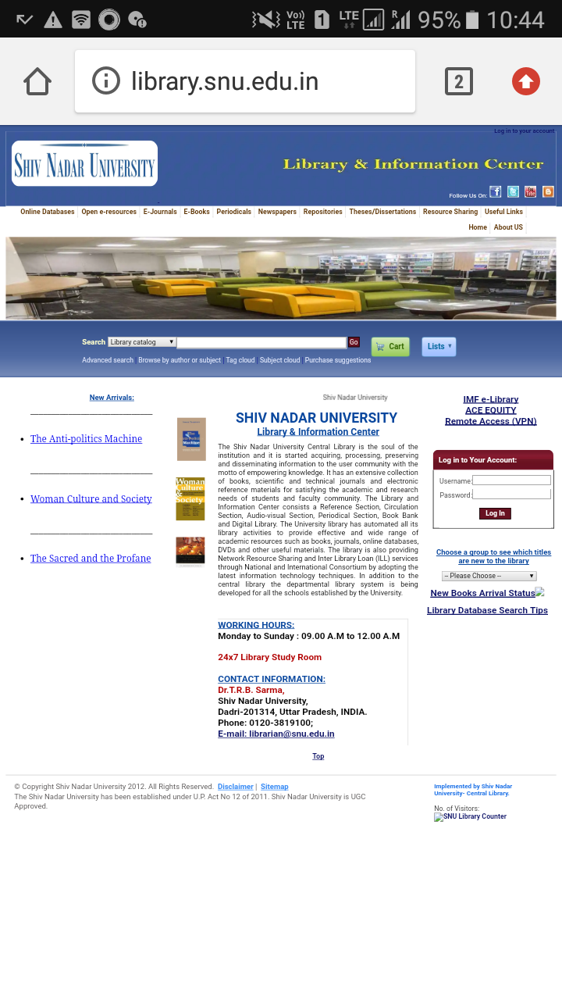
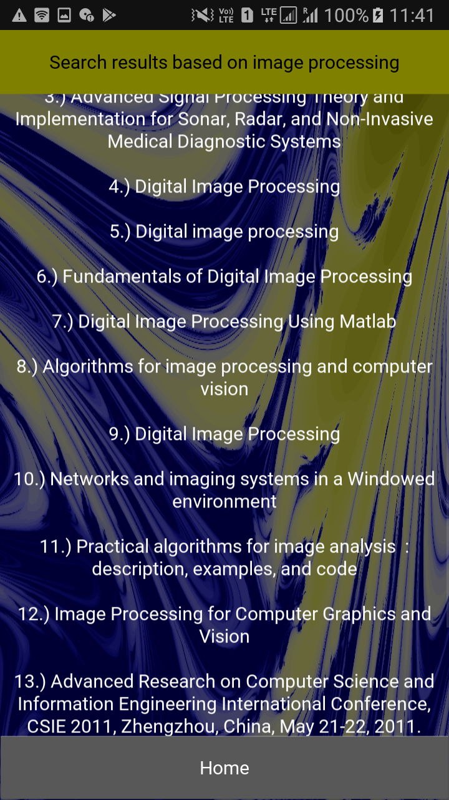
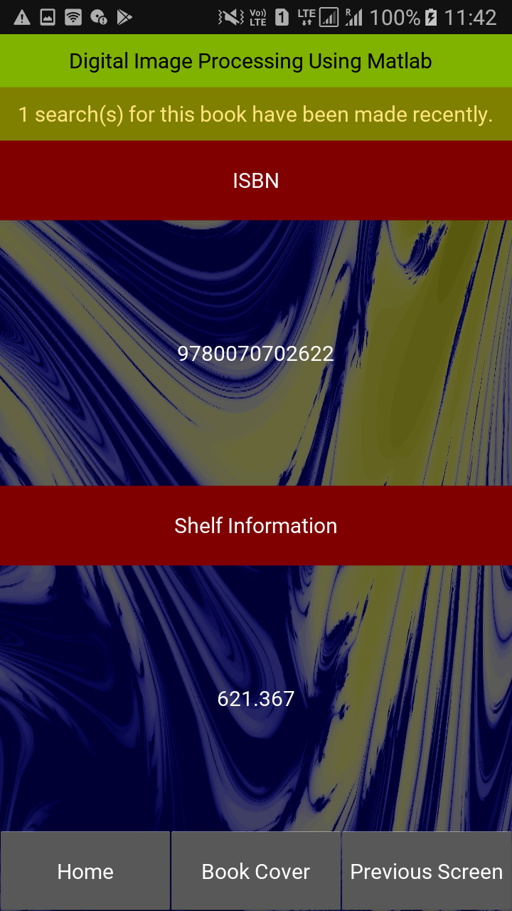

# Digital SNU Library (DSL)
The DSL aims at making library search more fast and efficient. We, as students of SNU, have always faced the bad interface of online library website on cell phone. The website looks like this on a phone.

There is no cell phone dedicated website for the SNU Library. Therefore, DSL can significantly reduce your efforts here because most of the students use library website when a professor recommends some books. At that point, everyone attacks on the website through a cell phone (few through computers as well). The condition of the website is something which you have witnessed above. The screenshot below shows the library app home screen, which has a quite simple interface.

The result page is also quite simple in nature,

The library app also has an interesting feature which the original website does not have. The feature which I think might help you in letting you know your chances to grab the book you are aiming at. This feature tells you the number of people who have searched that particular book **recently**. This feature sets to its default value (i.e. zero) at UTC 12 AM. The app also provides you with ISBN of the book which can be quite helpful for you if you want to know more about the book.

## .apk file location
The APK file is in the /bin folder above. Please download your .apk from there.

# DISCLAIMER
The app will differ from the screenshots shown above. The above screenshots are taken from a more developed version of this app.

# Author
Himanshu Sharma
